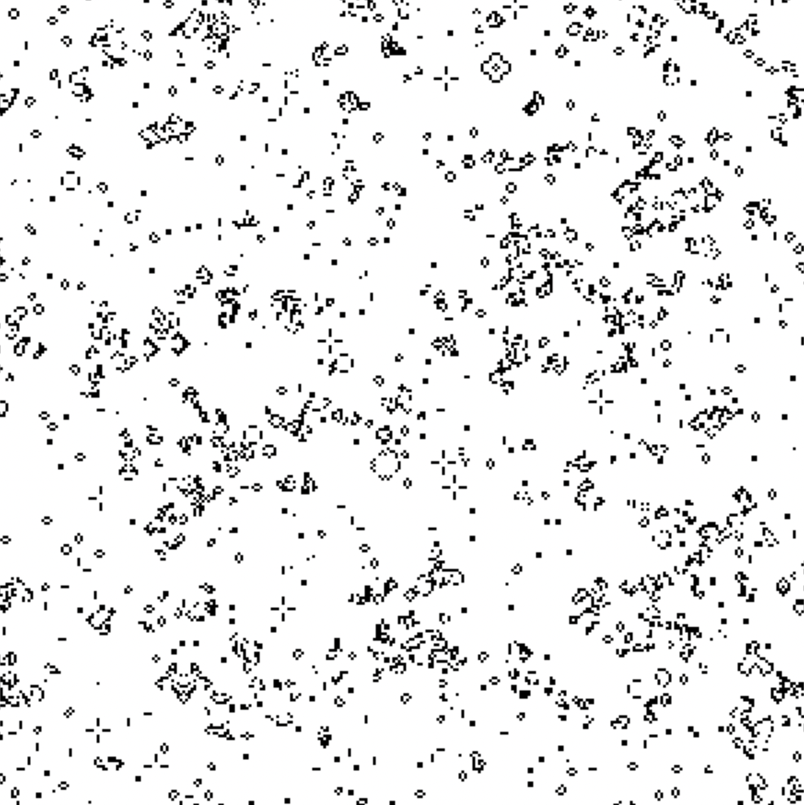

# electro_cell

A cellular automat written in electron typescript.

## quick start

install dependencies:

    yarn

run app:

    npm start

package application:

    yarn package

## development

run the unittests:

    npm test
